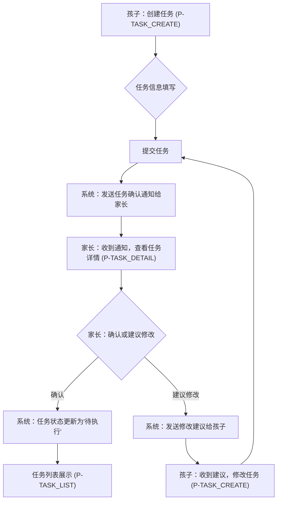
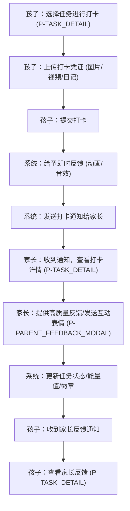
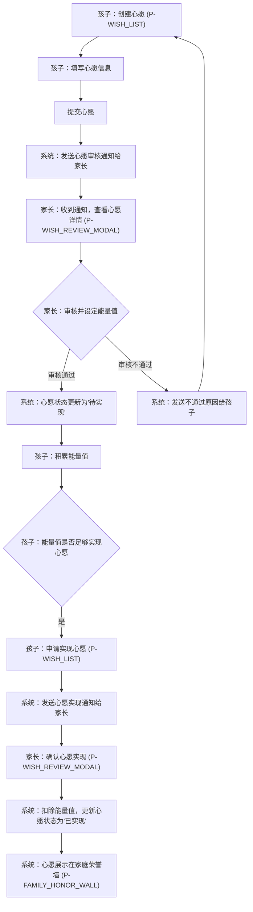
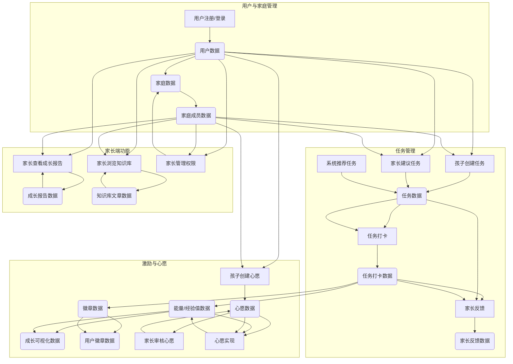

# 星火计划产品需求文档

## 1. 产品概述

### 1.1 产品名称与定位

*   **产品名称:** 星火计划
*   **产品定位:** 一款旨在通过科学方法激发并保护孩子内在驱动力的家庭互动Web应用。它不是一个监控工具，而是一个连接家长与孩子，共同设定目标、见证成长、分享喜悦的赋能平台。

### 1.2 产品应用语言

*   **产品应用语言:** 简体中文

### 1.3 产品愿景与目标

*   **产品愿景:** 告别“催促与被催促”的模式，转变为“引导与主动”的伙伴关系。让孩子成为自己成长的主人。
*   **产品目标:**
    *   赋能孩子：通过自主选择、趣味互动和即时反馈，提升孩子的自我决定感和胜任感。
    *   赋能家长：提供科学育儿知识和工具，帮助家长有效引导孩子，建立积极的亲子互动模式。
    *   建立家庭连接：通过共同参与和分享，增强家庭成员间的归属感和情感连接。
    *   成为内驱力培养领域的标杆产品，获得用户认可和市场份额。

### 1.4 产品使用终端

*   **主要终端:** Web端桌面应用
*   **浏览器支持:** Chrome 90+、Firefox 88+、Safari 14+、Edge 90+
*   **分辨率支持:** 768x480及以上分辨率，最佳体验为1920x1080
*   **响应式适配:** 支持768px以上的所有桌面和平板设备。

### 1.5 核心价值主张

*   **科学驱动:** 基于“自我决定理论”（自主、胜任、归属）设计，提供有理论支撑的内驱力培养方案。
*   **赋能而非控制:** 强调孩子的自主选择权，让孩子成为成长的主导者。
*   **过程重于结果:** 激励机制聚焦努力、坚持和进步，而非单纯的任务完成。
*   **亲子共成长:** 搭建家长与孩子共同参与、互动、分享的平台，促进亲子关系。
*   **趣味化体验:** 通过游戏化元素和生动的交互，让成长过程充满乐趣。

### 1.6 目标用户群体分析

*   **核心用户:** 6-12岁的儿童。
    *   **特征:** 开始建立独立意识，能够理解目标和奖励，对新奇的互动形式有浓厚兴趣。
    *   **需求:** 渴望被认可，希望通过自己的努力获得成就感，享受探索和学习的乐趣。
*   **管理用户:** 关注孩子成长、希望用科学方法替代传统说教和物质奖励的家长。
    *   **特征:** 重视孩子的全面发展，愿意学习和尝试新的教育理念，希望与孩子建立良好的沟通和互动关系。
    *   **需求:** 需要具体、可操作的工具来引导孩子，获取专业的育儿知识，了解孩子的成长进展。

### 1.7 市场需求与竞品简析

*   **市场需求:**
    *   随着教育理念的升级，家长对传统“说教式”和“物质奖励式”教育的局限性有了更深刻的认识，对科学、系统的内驱力培养工具需求日益增长。
    *   疫情常态化后，家庭场景下的亲子互动和教育成为重点，线上工具的需求持续旺盛。
    *   市场缺乏真正以“赋能孩子”为核心，且有坚实心理学理论支撑的产品。
*   **竞品简析:**
    *   **传统打卡/任务管理类App:** 多以任务完成和物质奖励为核心，缺乏对孩子内在动机的关注和培养，容易导致“贿赂化”。
    *   **在线教育/学习平台:** 侧重知识传授，而非学习动力和习惯的培养。
    *   **亲子互动游戏:** 娱乐性强，但缺乏系统性的成长引导和教育目标。
*   **星火计划优势:** 区别于市场上的竞品，星火计划以“自我决定理论”为核心，强调赋能、过程和内在奖励，提供家长高质量反馈机制和专业知识库，形成差异化竞争优势。

### 1.8 浏览器兼容性要求

*   **桌面浏览器:**
    *   Google Chrome (最新2个稳定版本)
    *   Mozilla Firefox (最新2个稳定版本)
    *   Microsoft Edge (最新2个稳定版本)
    *   Apple Safari (最新2个稳定版本)
*   **最低分辨率:** 1024x768px
*   **推荐分辨率:** 1920x1080px

## 2. 功能规格

### 2.1 功能详述

#### 2.1.1 用户管理与设置 (F-USER)

| 功能ID | 功能名称 | 功能描述 | 优先级 |
|--------|---------|---------|--------|
| F-USER_001 | 账户注册与登录 | 支持家长和孩子通过手机号/邮箱注册账户，并进行登录。提供密码找回功能。 | P0 |
| F-USER_002 | 家庭关联 | 家长创建家庭后，可邀请孩子加入家庭。孩子接受邀请后，与家长账户建立关联。支持多孩子家庭管理。 | P0 |
| F-USER_003 | 个人资料管理 | 用户可编辑头像、昵称、性别、生日等个人信息。 | P1 |
| F-USER_004 | 安全设置 | 提供修改密码、绑定手机/邮箱、两步验证等安全功能。 | P1 |
| F-USER_005 | 通知偏好设置 | 用户可自定义接收通知的类型（如任务提醒、家长反馈、系统消息）和方式（站内信、邮件、短信）。 | P2 |
| F-USER_006 | 界面主题设置 | 提供多种界面主题供用户选择，满足个性化需求。 | P2 |

#### 2.1.2 目标/任务中心 (F-TASK)

| 功能ID | 功能名称 | 功能描述 | 优先级 |
|--------|---------|---------|--------|
| F-TASK_001 | 任务创建（孩子端） | 孩子可自主创建任务，填写任务名称、描述、目标、计划完成时间、所属分类。创建后需家长确认。 | P0 |
| F-TASK_002 | 任务建议（家长端） | 家长可向孩子发布任务建议，填写任务名称、描述、目标、计划完成时间、所属分类。孩子可选择接受或拒绝。 | P0 |
| F-TASK_003 | 系统推荐任务 | 应用内置“兴趣探索库”，根据孩子年龄、兴趣等推荐任务，孩子可自主选择加入。 | P0 |
| F-TASK_004 | 任务分类管理 | 支持习惯养成、学习探索、兴趣技能、家庭贡献四大类任务的创建、查看和筛选。 | P0 |
| F-TASK_005 | 任务列表展示 | 展示待完成、进行中、已完成的任务列表，支持按分类、状态、时间排序和筛选。 | P0 |
| F-TASK_006 | 任务详情查看 | 查看任务的详细信息，包括任务描述、目标、进度、打卡记录、家长反馈等。 | P0 |
| F-TASK_007 | 任务打卡 | 孩子完成任务后，可进行打卡。支持上传图片、录制音视频、撰写探索日记作为完成凭证。 | P0 |
| F-TASK_008 | 即时反馈 | 任务打卡后，系统立即给予积极的动画效果和音效反馈，如“能量+10”、“经验值UP！”。 | P0 |
| F-TASK_009 | 任务编辑与删除 | 任务创建者（孩子或家长）可在任务未完成前编辑任务信息，或删除任务。 | P1 |
| F-TASK_010 | 任务确认（家长端） | 家长收到孩子创建任务的通知后，可进行“确认”或“建议修改”操作。 | P0 |

#### 2.1.3 激励与反馈系统 (F-INCENTIVE)

| 功能ID | 功能名称 | 功能描述 | 优先级 |
|--------|---------|---------|--------|
| F-INCENTIVE_001 | 能量/经验值管理 | 孩子每次完成任务获得能量/经验值，用于解锁后续内容和实现心愿。系统自动记录和更新。 | P0 |
| F-INCENTIVE_002 | 成就徽章系统 | 设立多维度徽章，如“坚持不懈奖”（连续7天完成任务）、“探索家奖”（首次尝试新领域的任务）、“创意大师奖”（用有趣方式完成任务）。徽章自动发放并展示。 | P0 |
| F-INCENTIVE_003 | 成长可视化 | 通过虚拟形象或元素（如成长树、知识星球）直观展示孩子的努力成果。能量值增加时，虚拟形象或元素随之成长或变化。 | P0 |
| F-INCENTIVE_004 | 心愿清单管理（孩子端） | 孩子可在应用内建立自己的“心愿清单”，填写心愿名称、描述、所需能量值。 | P0 |
| F-INCENTIVE_005 | 心愿审核与定价（家长端） | 家长可对孩子提交的心愿进行审核，并与孩子商量设定合理的“能量值”门槛。 | P0 |
| F-INCENTIVE_006 | 心愿实现 | 孩子积累足够能量值后，可申请实现心愿。家长确认后，心愿状态更新为“已实现”。 | P0 |
| F-INCENTIVE_007 | 家长高质量反馈 | 孩子每次打卡后，家长端收到通知。家长可对孩子的打卡内容进行评论，系统提供评论模板引导家长进行具体、积极的反馈。 | P0 |
| F-INCENTIVE_008 | 互动表情发送 | 家长可向孩子发送“点赞”、“拥抱”、“加油”等互动表情，增强情感连接。 | P0 |
| F-INCENTIVE_009 | 家庭荣誉墙 | 展示孩子获得的重要徽章、完成的精彩作品（图片/视频），供家庭成员共同看见和点赞。 | P0 |

#### 2.1.4 家长端功能 (F-PARENT)

| 功能ID | 功能名称 | 功能描述 | 优先级 |
|--------|---------|---------|--------|
| F-PARENT_001 | 成长报告生成 | 以周或月为单位，生成非评判性的成长报告。报告内容包括孩子在各领域的探索次数、获得的徽章、家长反馈次数等。 | P0 |
| F-PARENT_002 | 知识库/微课堂 | 内置简短的文章或视频，教家长如何进行成长型思维对话、如何保护孩子的好奇心、如何设定合理的目标等。 | P0 |
| F-PARENT_003 | 权限管理 | 家长可管理家庭成员（如添加/移除孩子），设置任务建议、审核心愿等功能的权限。 | P0 |
| F-PARENT_004 | 孩子账户管理 | 家长可查看和管理孩子的账户状态、个人资料等。 | P1 |
| F-PARENT_005 | 数据统计与分析 | 提供孩子任务完成情况、能量值增长趋势、兴趣偏好等数据的统计图表。 | P1 |

### 2.2 功能模块间的关系图

```mermaid
graph TD
    subgraph "用户管理与设置"
        A[F-USER_001: 账户注册与登录] --> B[F-USER_002: 家庭关联]
        B --> C[F-USER_003: 个人资料管理]
        C --> D[F-USER_004: 安全设置]
        D --> E[F-USER_005: 通知偏好设置]
        E --> F[F-USER_006: 界面主题设置]
    end

    subgraph "目标/任务中心"
        G[F-TASK_001: 任务创建(孩子)] --> H[F-TASK_010: 任务确认(家长)]
        I[F-TASK_002: 任务建议(家长)] --> J[F-TASK_005: 任务列表展示]
        K[F-TASK_003: 系统推荐任务] --> J
        J --> L[F-TASK_006: 任务详情查看]
        L --> M[F-TASK_007: 任务打卡]
        M --> N[F-TASK_008: 即时反馈]
        J --> O[F-TASK_009: 任务编辑与删除]
        H --> J
    end

    subgraph "激励与反馈系统"
        N --> P[F-INCENTIVE_001: 能量/经验值管理]
        P --> Q[F-INCENTIVE_003: 成长可视化]
        P --> R[F-INCENTIVE_002: 成就徽章系统]
        R --> S[F-INCENTIVE_009: 家庭荣誉墙]
        T[F-INCENTIVE_004: 心愿清单管理(孩子)] --> U[F-INCENTIVE_005: 心愿审核与定价(家长)]
        U --> V[F-INCENTIVE_006: 心愿实现]
        M --> W[F-INCENTIVE_007: 家长高质量反馈]
        W --> X[F-INCENTIVE_008: 互动表情发送]
        S --> X
    end

    subgraph "家长端功能"
        Y[F-PARENT_001: 成长报告生成] --> Z[F-PARENT_005: 数据统计与分析]
        AA[F-PARENT_002: 知识库/微课堂] --> AB[F-PARENT_003: 权限管理]
        AB --> AC[F-PARENT_004: 孩子账户管理]
        H --> AB
        U --> AB
    end

    B --> G
    B --> I
    B --> T
    B --> Y
    B --> AA
    B --> AB
    J --> P
    L --> W
    S --> Y
    Z --> Y
```

## 3. 用户流程

### 3.1 用户旅程地图

#### 3.1.1 孩子用户旅程

| 阶段 | 行为 | 思考/感受 | 触点 | 痛点 | 机会点 |
|------|------|-----------|------|------|--------|
| **发现与注册** | 家长引导注册/登录 | 好奇，期待 | 注册/登录页（P-LOGIN） | 注册流程复杂 | 简化注册，趣味引导 |
| **探索任务** | 浏览任务列表，选择任务 | 兴奋，选择困难 | 任务列表页（P-TASK_LIST） | 任务太多不知选哪个 | 智能推荐，清晰分类 |
| **创建任务** | 提出自己的任务想法 | 自豪，希望被认可 | 任务创建页（P-TASK_CREATE） | 不知如何描述任务 | 提供模板，引导描述 |
| **执行任务** | 完成任务，准备打卡 | 努力，成就感 | 任务详情页（P-TASK_DETAIL） | 忘记打卡，打卡方式单一 | 提醒功能，多样打卡方式 |
| **打卡反馈** | 上传凭证，等待反馈 | 期待，紧张 | 任务打卡弹窗（P-TASK_CHECKIN_MODAL） | 家长反馈不及时或敷衍 | 即时反馈，引导家长高质量反馈 |
| **获得激励** | 看到能量增长，徽章点亮 | 开心，满足 | 个人主页（P-CHILD_DASHBOARD） | 激励不够吸引人 | 丰富虚拟奖励，可视化成长 |
| **实现心愿** | 积累能量，兑换心愿 | 期待，满足 | 心愿清单页（P-WISH_LIST） | 心愿实现流程不清晰 | 简化兑换流程，增强仪式感 |
| **家庭互动** | 查看荣誉墙，与家长互动 | 温暖，被爱 | 家庭荣誉墙页（P-FAMILY_HONOR_WALL） | 互动形式单一 | 增加互动表情，点赞功能 |

#### 3.1.2 家长用户旅程

| 阶段 | 行为 | 思考/感受 | 触点 | 痛点 | 机会点 |
|------|------|-----------|------|------|--------|
| **注册与关联** | 注册账户，邀请孩子 | 期待，责任感 | 注册/登录页（P-LOGIN），家庭管理页（P-FAMILY_MANAGE） | 关联流程复杂 | 简化邀请流程，清晰指引 |
| **任务管理** | 建议任务，确认孩子任务 | 关心，引导 | 任务建议页（P-TASK_SUGGEST），任务确认弹窗（P-TASK_CONFIRM_MODAL） | 不知如何建议，确认不及时 | 提供任务建议库，及时通知 |
| **查看进展** | 浏览孩子任务列表，查看打卡 | 欣慰，了解 | 家长仪表盘（P-PARENT_DASHBOARD），任务列表页（P-TASK_LIST） | 信息分散，难以全面了解 | 统一仪表盘，清晰数据展示 |
| **提供反馈** | 对孩子打卡进行评论 | 鼓励，连接 | 任务详情页（P-TASK_DETAIL），家长反馈弹窗（P-PARENT_FEEDBACK_MODAL） | 不知如何有效反馈 | 提供反馈模板，引导高质量沟通 |
| **审核心愿** | 审核孩子心愿，设定能量值 | 协商，教育 | 心愿审核弹窗（P-WISH_REVIEW_MODAL） | 心愿不合理，能量值设定难 | 提供建议，引导合理设定 |
| **查看报告** | 阅读成长报告，了解孩子发展 | 洞察，放心 | 成长报告页（P-GROWTH_REPORT） | 报告枯燥，数据不直观 | 可视化报告，突出亮点 |
| **学习育儿** | 浏览知识库，提升育儿技能 | 学习，成长 | 知识库页（P-KNOWLEDGE_BASE） | 内容晦涩，实用性不强 | 提供微课堂，案例分享 |

### 3.2 关键业务流程图

#### 3.2.1 任务创建与确认流程



#### 3.2.2 任务打卡与反馈流程



#### 3.2.3 心愿管理与实现流程



### 3.3 各场景下的用户操作步骤

#### 3.3.1 孩子创建任务

1.  **孩子** 登录星火计划（P-LOGIN）。
2.  **孩子** 进入任务列表页（P-TASK_LIST）。
3.  **孩子** 点击“创建任务”按钮。
4.  **孩子** 在任务创建页（P-TASK_CREATE）填写任务名称、描述、目标、计划完成时间、所属分类。
5.  **孩子** 点击“提交”按钮。
6.  **系统** 提示任务已提交，等待家长确认。
7.  **家长** 收到任务确认通知。
8.  **家长** 点击通知，进入任务详情页（P-TASK_DETAIL）查看任务。
9.  **家长** 点击“确认”或“建议修改”按钮。
10. **系统** 根据家长操作更新任务状态，并通知孩子。

#### 3.3.2 家长提供高质量反馈

1.  **孩子** 完成任务并打卡（P-TASK_CHECKIN_MODAL）。
2.  **系统** 发送打卡通知给家长。
3.  **家长** 收到通知，点击进入任务详情页（P-TASK_DETAIL）。
4.  **家长** 查看孩子上传的打卡凭证。
5.  **家长** 点击“提供反馈”按钮，弹出家长反馈弹窗（P-PARENT_FEEDBACK_MODAL）。
6.  **家长** 在弹窗中选择反馈模板或输入自定义评论，并可选择发送互动表情。
7.  **家长** 点击“发送”按钮。
8.  **系统** 将反馈内容显示在任务详情页，并通知孩子。
9.  **孩子** 收到家长反馈通知，点击查看。

#### 3.3.3 孩子实现心愿

1.  **孩子** 登录星火计划（P-LOGIN）。
2.  **孩子** 进入心愿清单页（P-WISH_LIST）。
3.  **孩子** 点击“创建心愿”按钮，填写心愿信息并提交。
4.  **家长** 收到心愿审核通知，进入心愿审核弹窗（P-WISH_REVIEW_MODAL）。
5.  **家长** 审核心愿，设定所需能量值，并点击“通过”。
6.  **孩子** 继续完成任务，积累能量值。
7.  **孩子** 再次进入心愿清单页（P-WISH_LIST），发现心愿能量值已足够。
8.  **孩子** 点击“申请实现”按钮。
9.  **家长** 收到心愿实现通知，进入心愿审核弹窗（P-WISH_REVIEW_MODAL）。
10. **家长** 确认心愿已实现，点击“确认实现”。
11. **系统** 扣除孩子能量值，更新心愿状态为“已实现”，并将心愿展示在家庭荣誉墙（P-FAMILY_HONOR_WALL）。

## 4. 数据流设计

### 4.1 数据结构与关系

*   **用户 (User)**
    *   `user_id` (PK)
    *   `username`
    *   `password_hash`
    *   `email`
    *   `phone_number`
    *   `role` (家长/孩子)
    *   `avatar_url`
    *   `nickname`
    *   `gender`
    *   `birthday`
    *   `created_at`
    *   `updated_at`
*   **家庭 (Family)**
    *   `family_id` (PK)
    *   `family_name`
    *   `creator_user_id` (FK to User)
    *   `created_at`
*   **家庭成员 (FamilyMember)**
    *   `family_member_id` (PK)
    *   `family_id` (FK to Family)
    *   `user_id` (FK to User)
    *   `role_in_family` (家长/孩子)
    *   `joined_at`
*   **任务 (Task)**
    *   `task_id` (PK)
    *   `family_id` (FK to Family)
    *   `creator_user_id` (FK to User)
    *   `assignee_user_id` (FK to User, for孩子任务)
    *   `task_name`
    *   `description`
    *   `category` (习惯养成/学习探索/兴趣技能/家庭贡献)
    *   `status` (待确认/待执行/进行中/已完成/已拒绝)
    *   `target_date`
    *   `created_at`
    *   `updated_at`
*   **任务打卡 (TaskCheckin)**
    *   `checkin_id` (PK)
    *   `task_id` (FK to Task)
    *   `user_id` (FK to User)
    *   `checkin_time`
    *   `content_type` (text/image/video/diary)
    *   `content_url` (for image/video)
    *   `text_content` (for text/diary)
    *   `energy_awarded`
    *   `badge_awarded_id` (FK to Badge, if any)
*   **家长反馈 (ParentFeedback)**
    *   `feedback_id` (PK)
    *   `checkin_id` (FK to TaskCheckin)
    *   `parent_user_id` (FK to User)
    *   `feedback_content`
    *   `emoji_type` (点赞/拥抱/加油等)
    *   `created_at`
*   **能量/经验值 (EnergyLog)**
    *   `log_id` (PK)
    *   `user_id` (FK to User)
    *   `change_amount` (正数为增加，负数为减少)
    *   `reason` (任务完成/心愿实现/系统调整)
    *   `related_id` (FK to TaskCheckin/Wish, if applicable)
    *   `created_at`
*   **徽章 (Badge)**
    *   `badge_id` (PK)
    *   `badge_name`
    *   `description`
    *   `icon_url`
    *   `criteria` (获得条件)
*   **用户徽章 (UserBadge)**
    *   `user_badge_id` (PK)
    *   `user_id` (FK to User)
    *   `badge_id` (FK to Badge)
    *   `awarded_at`
*   **心愿 (Wish)**
    *   `wish_id` (PK)
    *   `user_id` (FK to User)
    *   `family_id` (FK to Family)
    *   `wish_name`
    *   `description`
    *   `required_energy`
    *   `status` (待审核/待实现/已实现/已拒绝)
    *   `created_at`
    *   `updated_at`
*   **成长报告 (GrowthReport)**
    *   `report_id` (PK)
    *   `user_id` (FK to User)
    *   `family_id` (FK to Family)
    *   `report_period` (周/月)
    *   `start_date`
    *   `end_date`
    *   `content_json` (存储报告详细数据)
    *   `generated_at`
*   **知识库文章 (KnowledgeArticle)**
    *   `article_id` (PK)
    *   `title`
    *   `content`
    *   `category`
    *   `author`
    *   `publish_date`

### 4.2 关键数据流向图



### 4.3 数据存储与处理原则

1.  **数据安全与隐私:**
    *   所有用户敏感数据（如密码、手机号、邮箱）必须进行加密存储。
    *   严格遵守儿童信息保护法规，对儿童个人信息进行特殊保护。
    *   数据传输采用HTTPS加密协议。
    *   定期进行安全审计和漏洞扫描。
2.  **数据完整性与一致性:**
    *   采用事务管理确保数据操作的原子性、一致性、隔离性和持久性。
    *   建立完善的数据校验机制，防止非法数据写入。
    *   定期进行数据备份和恢复演练。
3.  **数据可扩展性:**
    *   数据库设计应考虑未来功能扩展的需求，采用范式化设计，减少数据冗余。
    *   对于高并发场景，考虑读写分离、分库分表等方案。
4.  **数据处理:**
    *   能量值、徽章等计算逻辑应在后端统一处理，确保数据准确性。
    *   成长报告的生成应采用异步处理，避免影响用户体验。
    *   图片、音视频等大文件采用云存储服务，并通过CDN加速访问。
5.  **数据可视化:**
    *   成长报告、数据统计等功能应提供直观的图表展示，方便用户理解。

## 5. 页面规格

### 5.1 页面概览

#### 5.1.1 整体布局架构

*   **布局模式:** Web端响应式布局 - 固定顶部导航栏 + 可折叠左侧菜单(240px/56px) + 主内容区(最小900px) + 智能右侧面板(300px，条件显示)
*   **空间分配策略:**
    *   超大屏幕(≥1600px): 顶部60px + 左侧240px + 主内容区(动态) + 右侧300px
    *   大屏幕(1400-1599px): 顶部60px + 左侧240px + 主内容区(动态) + 右侧面板(仅≥1500px时显示，否则隐藏)
    *   中屏幕(1200-1399px): 顶部60px + 左侧240px + 主内容区(充满剩余空间)，右侧面板完全隐藏
    *   小屏幕(1024-1199px): 顶部60px + 左侧56px(自动折叠) + 主内容区(充满剩余空间)
*   **导航体系:** 顶部主导航 + 左侧功能菜单 + 面包屑导航
*   **交互模式:** 主内容区切换 + 模态弹窗 + 侧边抽屉 + 确认对话框
*   **右侧面板智能控制:** 仅在屏幕宽度≥1500px且提供不可替代的核心辅助功能时显示，内容必须100%可选，主功能绝不依赖右侧面板，隐藏时所有信息必须在主内容区有完整替代展示。

#### 5.1.2 页面列表

| 页面ID | 页面名称 | 核心功能 | 布局类型 | 右侧面板 |
|--------|---------|---------|---------|---------|
| P-LOGIN | 登录/注册页 | 用户登录、注册、密码找回 | 单栏居中 | 不使用 |
| P-PARENT_DASHBOARD | 家长仪表盘 | 家长概览、快捷入口、数据总览 | 智能三栏布局 | 条件显示(快捷操作、通知) |
| P-CHILD_DASHBOARD | 孩子仪表盘 | 孩子概览、成长可视化、任务快捷入口 | 智能三栏布局 | 条件显示(能量值、徽章预览) |
| P-TASK_LIST | 任务列表页 | 任务列表展示、筛选、搜索 | 二栏布局 | 不使用 |
| P-TASK_CREATE | 任务创建页 | 孩子创建任务、家长建议任务 | 二栏布局 | 不使用 |
| P-TASK_DETAIL | 任务详情页 | 任务详情查看、打卡、家长反馈 | 二栏布局 | 不使用 |
| P-WISH_LIST | 心愿清单页 | 心愿列表展示、创建、申请实现 | 二栏布局 | 不使用 |
| P-FAMILY_HONOR_WALL | 家庭荣誉墙页 | 展示孩子成就、作品、互动点赞 | 二栏布局 | 不使用 |
| P-GROWTH_REPORT | 成长报告页 | 生成与查看孩子成长报告 | 二栏布局 | 不使用 |
| P-KNOWLEDGE_BASE | 知识库页 | 浏览育儿知识文章、视频 | 二栏布局 | 不使用 |
| P-FAMILY_MANAGE | 家庭管理页 | 家庭成员管理、权限设置 | 二栏布局 | 不使用 |
| P-USER_PROFILE | 个人资料页 | 用户个人信息编辑、安全设置 | 二栏布局 | 不使用 |
| P-SETTINGS | 系统设置页 | 通知偏好、界面主题设置 | 二栏布局 | 不使用 |
| P-TASK_SUGGEST | 任务建议页 | 家长向孩子发布任务建议 | 二栏布局 | 不使用 |
| P-TASK_CONFIRM_MODAL | 任务确认弹窗 | 家长确认孩子创建的任务 | 模态弹窗 | 不适用 |
| P-TASK_CHECKIN_MODAL | 任务打卡弹窗 | 孩子上传任务打卡凭证 | 模态弹窗 | 不适用 |
| P-PARENT_FEEDBACK_MODAL | 家长反馈弹窗 | 家长对孩子打卡提供反馈 | 模态弹窗 | 不适用 |
| P-WISH_REVIEW_MODAL | 心愿审核弹窗 | 家长审核孩子心愿、设定能量值 | 模态弹窗 | 不适用 |

### 5.2 页面详情

#### 5.2.1 登录/注册页（P-LOGIN）

**布局架构设计：**
- 页面类型：功能型页面，用户身份验证入口。
- 布局模式：单栏居中布局，简洁明了。
- 空间分配：核心表单区域居中显示，背景为产品主题元素。

**页面布局架构：**
- 顶部导航栏：无。
- 左侧菜单：无。
- 主内容区域：
  - 登录/注册表单区域：居中显示，包含Logo、标题、输入框（用户名/手机号/邮箱、密码）、验证码、登录/注册按钮、忘记密码链接、切换登录/注册模式链接。
- 右侧面板：无。

**响应式适配策略：**
- 超大屏幕(≥1600px)：表单区域最大宽度400px，居中显示。
- 大屏幕(1400-1599px)：表单区域最大宽度400px，居中显示。
- 中屏幕(1200-1399px)：表单区域最大宽度400px，居中显示。
- 小屏幕(1024-1199px)：表单区域最大宽度400px，居中显示。
- 平板端(768-1023px)：表单区域宽度自适应，最大宽度500px，居中显示。
- 移动端(<768px)：表单区域宽度100%，自适应屏幕宽度，上下边距保留。

**组件尺寸规范：**
- 按钮尺寸：登录/注册按钮高度40px，宽度100%。
- 输入框：高度40px，宽度100%。
- 间距规范：输入框间距16px，按钮与输入框间距24px。

**核心功能：**
用户登录、新用户注册、密码找回。

#### 5.2.2 家长仪表盘（P-PARENT_DASHBOARD）

**布局架构设计：**
- 页面类型：概览型页面，家长日常操作入口。
- 布局模式：智能三栏布局，左侧菜单+主内容区+条件右侧面板。
- 空间分配：顶部导航固定，左侧菜单可折叠，主内容区占据大部分空间，右侧面板在条件满足时显示。

**页面布局架构：**
- 顶部导航栏：Logo、产品名称、全局搜索框、消息通知、用户头像、快速切换孩子入口 - 高度60px，固定定位。
- 左侧菜单：功能导航菜单（仪表盘、任务、心愿、荣誉墙、成长报告、知识库、家庭管理、个人资料、设置），当前选中“仪表盘”，支持折叠 - 宽度240px(展开)/56px(折叠)。
- 主内容区域：核心数据展示和快捷操作区域，最小900px宽度。
  - 页面头部：欢迎语、面包屑导航（仪表盘）、主要操作按钮组（如“建议任务”、“查看报告”） - 高度52px。
  - 数据概览区：卡片式展示孩子任务完成率、能量值、徽章数量、家长反馈次数等关键指标，支持多列布局 - 自适应高度。
  - 最近活动列表：表格形式展示孩子最近的任务打卡、心愿申请、徽章获得等动态，支持排序和筛选 - 自适应高度。
  - 待处理事项：列表形式展示待确认的任务、待审核的心愿等，提供快捷操作按钮 - 自适应高度。
- 右侧面板：仅在屏幕宽度≥1500px时显示，宽度300px。
  - 快捷操作区：常用功能的快捷入口，如“建议新任务”、“查看孩子主页”。
  - 通知中心：最新系统通知、孩子动态提醒。
  - 育儿小贴士：每日更新一条育儿知识摘要。

**响应式适配策略：**
- 超大屏幕(≥1600px)：完整三栏布局，左侧240px + 主内容区1060px+ + 右侧300px。
- 大屏幕(1400-1599px)：右侧面板仅在≥1500px时显示，左侧240px + 主内容区(充满剩余)。
- 中屏幕(1200-1399px)：强制二栏布局，左侧240px + 主内容区(充满剩余)，右侧面板完全隐藏。
- 小屏幕(1024-1199px)：强制二栏布局，左侧56px(自动折叠) + 主内容区(充满剩余)。
- 平板端(768-1023px)：左侧菜单抽屉式，右侧面板隐藏，主内容区充满，数据卡片改为2列布局。
- 移动端(<768px)：单栏布局，所有辅助面板隐藏，数据卡片单列显示，保持核心功能。

**组件尺寸规范：**
- 按钮尺寸：主要操作按钮36px高度，次要按钮32px高度。
- 输入框：全局搜索框36px高度。
- 统计卡片：高度120px，宽度自适应，最小200px。
- 表格行高：36px。
- 图标尺寸：导航图标20px，操作图标16px。
- 间距规范：卡片间距16px，区域间距20px，组件内间距12px。

**核心功能：**
家长概览孩子状态、快捷操作入口、查看最近活动、处理待办事项、接收通知。

**数据结构：**(最近活动列表)
| 列名 | 数据类型 | 宽度 | 是否可排序 | 操作功能 |
|------|---------|------|----------|---------|
| 活动类型 | 文本 | 100px | 否 | 筛选 |
| 关联内容 | 文本+链接 | 200px | 否 | 点击查看详情 |
| 孩子 | 文本 | 80px | 是 | 筛选 |
| 时间 | 相对时间 | 120px | 是 | 排序 |
| 操作 | 操作按钮组 | 100px | 否 | 查看/处理 |

#### 5.2.3 孩子仪表盘（P-CHILD_DASHBOARD）

**布局架构设计：**
- 页面类型：概览型页面，孩子日常操作入口。
- 布局模式：智能三栏布局，左侧菜单+主内容区+条件右侧面板。
- 空间分配：顶部导航固定，左侧菜单可折叠，主内容区占据大部分空间，右侧面板在条件满足时显示。

**页面布局架构：**
- 顶部导航栏：Logo、产品名称、全局搜索框、消息通知、用户头像 - 高度60px，固定定位。
- 左侧菜单：功能导航菜单（仪表盘、我的任务、我的心愿、家庭荣誉墙、个人资料、设置），当前选中“仪表盘”，支持折叠 - 宽度240px(展开)/56px(折叠)。
- 主内容区域：核心成长可视化和任务快捷入口，最小900px宽度。
  - 页面头部：欢迎语、面包屑导航（仪表盘）、主要操作按钮组（如“创建任务”、“查看心愿”） - 高度52px。
  - 成长可视化区：展示孩子的虚拟形象（如成长树、知识星球），直观显示能量值和成长进度 - 自适应高度。
  - 我的任务概览：卡片式展示待完成、进行中、已完成任务数量，提供快捷入口 - 自适应高度。
  - 最近获得徽章：展示孩子最近获得的徽章，点击可查看详情 - 自适应高度。
  - 家长最新反馈：展示家长最新的反馈内容，增强情感连接 - 自适应高度。
- 右侧面板：仅在屏幕宽度≥1500px时显示，宽度300px。
  - 能量值详情：显示当前能量值、能量获取历史。
  - 徽章预览：展示所有已获得和待获得的徽章列表。
  - 系统推荐任务：推荐适合孩子的系统任务。

**响应式适配策略：**
- 超大屏幕(≥1600px)：完整三栏布局，左侧240px + 主内容区1060px+ + 右侧300px。
- 大屏幕(1400-1599px)：右侧面板仅在≥1500px时显示，左侧240px + 主内容区(充满剩余)。
- 中屏幕(1200-1399px)：强制二栏布局，左侧240px + 主内容区(充满剩余)，右侧面板完全隐藏。
- 小屏幕(1024-1199px)：强制二栏布局，左侧56px(自动折叠) + 主内容区(充满剩余)。
- 平板端(768-1023px)：左侧菜单抽屉式，右侧面板隐藏，主内容区充满，卡片改为2列布局。
- 移动端(<768px)：单栏布局，所有辅助面板隐藏，卡片单列显示，保持核心功能。

**组件尺寸规范：**
- 按钮尺寸：主要操作按钮36px高度，次要按钮32px高度。
- 输入框：全局搜索框36px高度。
- 统计卡片：高度120px，宽度自适应，最小200px。
- 徽章图标：尺寸48x48px。
- 间距规范：卡片间距16px，区域间距20px，组件内间距12px。

**核心功能：**
孩子概览个人成长、查看任务进度、快速创建任务、查看家长反馈、管理心愿。

#### 5.2.4 任务列表页（P-TASK_LIST）

**布局架构设计：**
- 页面类型：列表型页面，展示和管理任务。
- 布局模式：二栏布局，左侧菜单+主内容区。
- 空间分配：顶部导航固定，左侧菜单可折叠，主内容区占据大部分空间。

**页面布局架构：**
- 顶部导航栏：同仪表盘。
- 左侧菜单：同仪表盘，当前选中“任务”。
- 主内容区域：任务列表展示和管理，最小900px宽度。
  - 页面头部：页面标题“我的任务”、面包屑导航、主要操作按钮组（如“创建任务”、“刷新”） - 高度52px。
  - 工具栏区域：搜索框、任务状态筛选（待确认/待执行/进行中/已完成）、任务分类筛选（习惯养成/学习探索/兴趣技能/家庭贡献）、排序选项（按时间/按能量值） - 高度44px，紧凑布局。
  - 数据展示区域：表格形式展示任务列表，支持多选、批量操作（如批量删除）。
  - 分页区域：分页控件，显示总数、每页条数选择、跳转功能 - 高度40px，右对齐。

**响应式适配策略：**
- 超大屏幕(≥1600px)：二栏布局，左侧240px + 主内容区1360px+。
- 大屏幕(1400-1599px)：二栏布局，左侧240px + 主内容区1160px+。
- 中屏幕(1200-1399px)：二栏布局，左侧240px + 主内容区960px+。
- 小屏幕(1024-1199px)：二栏布局，左侧56px(自动折叠) + 主内容区968px+。
- 平板端(768-1023px)：左侧菜单抽屉式，主内容区充满，表格列可折叠或横向滚动。
- 移动端(<768px)：单栏布局，表格转换为卡片列表或仅显示核心列，筛选条件收起。

**组件尺寸规范：**
- 按钮尺寸：主要操作按钮36px高度，次要按钮32px高度。
- 输入框：搜索框36px高度，筛选下拉框32px高度。
- 表格行高：36px。
- 间距规范：工具栏组件间距8-12px，区域间距16px。

**核心功能：**
任务列表展示、任务筛选与搜索、任务状态查看、任务详情入口、任务创建入口。

**数据结构：**(任务列表)
| 列名 | 数据类型 | 宽度 | 是否可排序 | 操作功能 |
|------|---------|------|----------|---------|
| 复选框 | 布尔值 | 40px | 否 | 多选 |
| 任务名称 | 文本+链接 | 250px | 是 | 点击查看详情 |
| 分类 | 标签 | 100px | 是 | 筛选 |
| 状态 | 标签 | 80px | 是 | 筛选 |
| 计划完成时间 | 日期 | 120px | 是 | 排序 |
| 能量值 | 数字 | 80px | 是 | 排序 |
| 创建者 | 文本 | 100px | 是 | 筛选 |
| 操作 | 操作按钮组 | 120px | 否 | 编辑/删除/打卡/反馈 |

#### 5.2.5 任务创建页（P-TASK_CREATE）

**布局架构设计：**
- 页面类型：表单型页面，用于创建和编辑任务。
- 布局模式：二栏布局，左侧菜单+主内容区。
- 空间分配：顶部导航固定，左侧菜单可折叠，主内容区居中显示表单。

**页面布局架构：**
- 顶部导航栏：同仪表盘。
- 左侧菜单：同仪表盘，当前选中“任务”。
- 主内容区域：任务创建/编辑表单，最小900px宽度。
  - 页面头部：页面标题“创建任务”/“编辑任务”、面包屑导航 - 高度52px。
  - 表单区域：包含任务名称、描述、目标、计划完成时间、所属分类等输入项，支持文本输入、日期选择、下拉选择。
  - 操作按钮区：提交、取消按钮。

**响应式适配策略：**
- 超大屏幕(≥1600px)：二栏布局，左侧240px + 主内容区1360px+，表单区域最大宽度800px，居中显示。
- 大屏幕(1400-1599px)：二栏布局，左侧240px + 主内容区1160px+，表单区域最大宽度800px，居中显示。
- 中屏幕(1200-1399px)：二栏布局，左侧240px + 主内容区960px+，表单区域最大宽度800px，居中显示。
- 小屏幕(1024-1199px)：二栏布局，左侧56px(自动折叠) + 主内容区968px+，表单区域最大宽度800px，居中显示。
- 平板端(768-1023px)：左侧菜单抽屉式，主内容区充满，表单区域宽度自适应。
- 移动端(<768px)：单栏布局，表单区域宽度100%，输入项垂直排列。

**组件尺寸规范：**
- 按钮尺寸：提交/取消按钮高度40px。
- 输入框：高度40px，文本域高度自适应。
- 间距规范：表单项间距16px，按钮间距12px。

**核心功能：**
孩子创建任务、家长建议任务、任务信息编辑。

#### 5.2.6 任务详情页（P-TASK_DETAIL）

**布局架构设计：**
- 页面类型：详情型页面，展示任务详细信息。
- 布局模式：二栏布局，左侧菜单+主内容区。
- 空间分配：顶部导航固定，左侧菜单可折叠，主内容区居中显示任务详情。

**页面布局架构：**
- 顶部导航栏：同仪表盘。
- 左侧菜单：同仪表盘，当前选中“任务”。
- 主内容区域：任务详细信息展示，最小900px宽度。
  - 页面头部：页面标题（任务名称）、面包屑导航、主要操作按钮组（如“编辑任务”、“删除任务”） - 高度52px。
  - 任务基本信息区：展示任务名称、描述、目标、计划完成时间、所属分类、创建者、状态等。
  - 打卡记录区：列表或时间线形式展示孩子的打卡记录，包含打卡时间、凭证（图片/视频/日记）、获得的能量值、徽章。
  - 家长反馈区：展示家长对每次打卡的反馈内容和互动表情。
  - 操作按钮区：根据任务状态显示“打卡”、“提供反馈”等按钮。

**响应式适配策略：**
- 超大屏幕(≥1600px)：二栏布局，左侧240px + 主内容区1360px+，内容区域最大宽度900px，居中显示。
- 大屏幕(1400-1599px)：二栏布局，左侧240px + 主内容区1160px+，内容区域最大宽度900px，居中显示。
- 中屏幕(1200-1399px)：二栏布局，左侧240px + 主内容区960px+，内容区域最大宽度900px，居中显示。
- 小屏幕(1024-1199px)：二栏布局，左侧56px(自动折叠) + 主内容区968px+，内容区域最大宽度900px，居中显示。
- 平板端(768-1023px)：左侧菜单抽屉式，主内容区充满，打卡记录和反馈可折叠或横向滚动。
- 移动端(<768px)：单栏布局，内容区域宽度100%，打卡凭证可点击放大。

**组件尺寸规范：**
- 按钮尺寸：操作按钮高度36px。
- 间距规范：信息块间距20px，打卡记录项间距16px。

**核心功能：**
查看任务详细信息、查看打卡记录、查看家长反馈、进行任务打卡、提供家长反馈。

#### 5.2.7 心愿清单页（P-WISH_LIST）

**布局架构设计：**
- 页面类型：列表型页面，展示和管理心愿。
- 布局模式：二栏布局，左侧菜单+主内容区。
- 空间分配：顶部导航固定，左侧菜单可折叠，主内容区占据大部分空间。

**页面布局架构：**
- 顶部导航栏：同仪表盘。
- 左侧菜单：同仪表盘，当前选中“心愿”。
- 主内容区域：心愿列表展示和管理，最小900px宽度。
  - 页面头部：页面标题“我的心愿”、面包屑导航、主要操作按钮组（如“创建心愿”） - 高度52px。
  - 工具栏区域：心愿状态筛选（待审核/待实现/已实现/已拒绝）、排序选项（按所需能量/按创建时间） - 高度44px，紧凑布局。
  - 数据展示区域：表格形式展示心愿列表，支持多选、批量操作（如批量删除）。
  - 分页区域：分页控件，显示总数、每页条数选择、跳转功能 - 高度40px，右对齐。

**响应式适配策略：**
- 超大屏幕(≥1600px)：二栏布局，左侧240px + 主内容区1360px+。
- 大屏幕(1400-1599px)：二栏布局，左侧240px + 主内容区1160px+。
- 中屏幕(1200-1399px)：二栏布局，左侧240px + 主内容区960px+。
- 小屏幕(1024-1199px)：二栏布局，左侧56px(自动折叠) + 主内容区968px+。
- 平板端(768-1023px)：左侧菜单抽屉式，主内容区充满，表格列可折叠或横向滚动。
- 移动端(<768px)：单栏布局，表格转换为卡片列表或仅显示核心列，筛选条件收起。

**组件尺寸规范：**
- 按钮尺寸：主要操作按钮36px高度，次要按钮32px高度。
- 输入框：筛选下拉框32px高度。
- 表格行高：36px。
- 间距规范：工具栏组件间距8-12px，区域间距16px。

**核心功能：**
心愿列表展示、心愿筛选与搜索、心愿详情查看、心愿创建、心愿申请实现。

**数据结构：**(心愿列表)
| 列名 | 数据类型 | 宽度 | 是否可排序 | 操作功能 |
|------|---------|------|----------|---------|
| 复选框 | 布尔值 | 40px | 否 | 多选 |
| 心愿名称 | 文本+链接 | 250px | 是 | 点击查看详情 |
| 所需能量 | 数字 | 100px | 是 | 排序 |
| 状态 | 标签 | 80px | 是 | 筛选 |
| 创建时间 | 日期 | 120px | 是 | 排序 |
| 操作 | 操作按钮组 | 120px | 否 | 编辑/删除/申请实现 |

#### 5.2.8 家庭荣誉墙页（P-FAMILY_HONOR_WALL）

**布局架构设计：**
- 页面类型：展示型页面，展示孩子成就和作品。
- 布局模式：二栏布局，左侧菜单+主内容区。
- 空间分配：顶部导航固定，左侧菜单可折叠，主内容区以网格或瀑布流形式展示内容。

**页面布局架构：**
- 顶部导航栏：同仪表盘。
- 左侧菜单：同仪表盘，当前选中“荣誉墙”。
- 主内容区域：荣誉展示区域，最小900px宽度。
  - 页面头部：页面标题“家庭荣誉墙”、面包屑导航 - 高度52px。
  - 内容展示区域：以卡片或网格形式展示孩子获得的徽章、完成的精彩作品（图片/视频），支持点赞功能。
  - 筛选/排序：可按孩子、类型（徽章/作品）、时间进行筛选和排序。

**响应式适配策略：**
- 超大屏幕(≥1600px)：二栏布局，左侧240px + 主内容区1360px+，内容卡片多列布局。
- 大屏幕(1400-1599px)：二栏布局，左侧240px + 主内容区1160px+，内容卡片多列布局。
- 中屏幕(1200-1399px)：二栏布局，左侧240px + 主内容区960px+，内容卡片3列布局。
- 小屏幕(1024-1199px)：二栏布局，左侧56px(自动折叠) + 主内容区968px+，内容卡片2列布局。
- 平板端(768-1023px)：左侧菜单抽屉式，主内容区充满，内容卡片2列布局。
- 移动端(<768px)：单栏布局，内容卡片单列显示。

**组件尺寸规范：**
- 内容卡片：高度自适应，宽度根据列数均分。
- 点赞按钮：尺寸32x32px。
- 间距规范：卡片间距16px，区域间距20px。

**核心功能：**
展示孩子获得的徽章、完成的精彩作品、家庭成员点赞互动。

#### 5.2.9 成长报告页（P-GROWTH_REPORT）

**布局架构设计：**
- 页面类型：数据展示型页面，展示孩子成长报告。
- 布局模式：二栏布局，左侧菜单+主内容区。
- 空间分配：顶部导航固定，左侧菜单可折叠，主内容区居中显示报告内容。

**页面布局架构：**
- 顶部导航栏：同仪表盘。
- 左侧菜单：同仪表盘，当前选中“成长报告”。
- 主内容区域：成长报告展示，最小900px宽度。
  - 页面头部：页面标题“成长报告”、面包屑导航、报告周期选择器（周/月） - 高度52px。
  - 报告内容区：以图表、数据卡片、文字描述等形式展示孩子在各领域的探索次数、获得的徽章、家长反馈次数、能量值增长趋势等。
  - 报告下载/分享按钮。

**响应式适配策略：**
- 超大屏幕(≥1600px)：二栏布局，左侧240px + 主内容区1360px+，报告内容区域最大宽度1000px，居中显示。
- 大屏幕(1400-1599px)：二栏布局，左侧240px + 主内容区1160px+，报告内容区域最大宽度1000px，居中显示。
- 中屏幕(1200-1399px)：二栏布局，左侧240px + 主内容区960px+，报告内容区域最大宽度1000px，居中显示。
- 小屏幕(1024-1199px)：二栏布局，左侧56px(自动折叠) + 主内容区968px+，报告内容区域最大宽度1000px，居中显示。
- 平板端(768-1023px)：左侧菜单抽屉式，主内容区充满，图表和数据卡片可折叠或横向滚动。
- 移动端(<768px)：单栏布局，报告内容垂直排列，图表简化。

**组件尺寸规范：**
- 按钮尺寸：报告周期选择器按钮高度32px。
- 图表区域：高度自适应，宽度根据内容适配。
- 间距规范：报告模块间距24px。

**核心功能：**
生成与查看孩子周/月度成长报告、下载/分享报告。

#### 5.2.10 知识库页（P-KNOWLEDGE_BASE）

**布局架构设计：**
- 页面类型：内容展示型页面，提供育儿知识。
- 布局模式：二栏布局，左侧菜单+主内容区。
- 空间分配：顶部导航固定，左侧菜单可折叠，主内容区以列表或卡片形式展示文章。

**页面布局架构：**
- 顶部导航栏：同仪表盘。
- 左侧菜单：同仪表盘，当前选中“知识库”。
- 主内容区域：知识库文章列表，最小900px宽度。
  - 页面头部：页面标题“知识库”、面包屑导航 - 高度52px。
  - 工具栏区域：搜索框、文章分类筛选（如“成长型思维”、“好奇心培养”）、排序选项（按发布时间/按热门度） - 高度44px，紧凑布局。
  - 数据展示区域：文章列表，每项包含标题、摘要、作者、发布时间、阅读量。
  - 分页区域：分页控件，显示总数、每页条数选择、跳转功能 - 高度40px，右对齐。

**响应式适配策略：**
- 超大屏幕(≥1600px)：二栏布局，左侧240px + 主内容区1360px+。
- 大屏幕(1400-1599px)：二栏布局，左侧240px + 主内容区1160px+。
- 中屏幕(1200-1399px)：二栏布局，左侧240px + 主内容区960px+。
- 小屏幕(1024-1199px)：二栏布局，左侧56px(自动折叠) + 主内容区968px+。
- 平板端(768-1023px)：左侧菜单抽屉式，主内容区充满，文章列表可折叠或横向滚动。
- 移动端(<768px)：单栏布局，文章列表单列显示，筛选条件收起。

**组件尺寸规范：**
- 按钮尺寸：筛选下拉框32px高度。
- 文章列表项：高度自适应，最小80px。
- 间距规范：工具栏组件间距8-12px，区域间距16px。

**核心功能：**
浏览育儿知识文章、搜索文章、按分类筛选文章。

**数据结构：**(文章列表)
| 列名 | 数据类型 | 宽度 | 是否可排序 | 操作功能 |
|------|---------|------|----------|---------|
| 标题 | 文本+链接 | 400px | 是 | 点击查看详情 |
| 分类 | 标签 | 120px | 是 | 筛选 |
| 作者 | 文本 | 100px | 是 | 筛选 |
| 发布时间 | 日期 | 120px | 是 | 排序 |
| 阅读量 | 数字 | 80px | 是 | 排序 |

#### 5.2.11 家庭管理页（P-FAMILY_MANAGE）

**布局架构设计：**
- 页面类型：管理型页面，管理家庭成员和权限。
- 布局模式：二栏布局，左侧菜单+主内容区。
- 空间分配：顶部导航固定，左侧菜单可折叠，主内容区居中显示管理列表。

**页面布局架构：**
- 顶部导航栏：同仪表盘。
- 左侧菜单：同仪表盘，当前选中“家庭管理”。
- 主内容区域：家庭成员列表和权限设置，最小900px宽度。
  - 页面头部：页面标题“家庭管理”、面包屑导航、主要操作按钮组（如“邀请成员”） - 高度52px。
  - 家庭成员列表：表格形式展示家庭成员，包含成员头像、昵称、角色、加入时间、操作（编辑/移除）。
  - 权限设置区：针对不同角色（家长/孩子）的功能权限配置，如任务建议权限、审核心愿权限等。

**响应式适配策略：**
- 超大屏幕(≥1600px)：二栏布局，左侧240px + 主内容区1360px+，内容区域最大宽度900px，居中显示。
- 大屏幕(1400-1599px)：二栏布局，左侧240px + 主内容区1160px+，内容区域最大宽度900px，居中显示。
- 中屏幕(1200-1399px)：二栏布局，左侧240px + 主内容区960px+，内容区域最大宽度900px，居中显示。
- 小屏幕(1024-1199px)：二栏布局，左侧56px(自动折叠) + 主内容区968px+，内容区域最大宽度900px，居中显示。
- 平板端(768-1023px)：左侧菜单抽屉式，主内容区充满，表格列可折叠或横向滚动。
- 移动端(<768px)：单栏布局，表格转换为卡片列表或仅显示核心列。

**组件尺寸规范：**
- 按钮尺寸：主要操作按钮36px高度，次要按钮32px高度。
- 表格行高：36px。
- 间距规范：工具栏组件间距8-12px，区域间距16px。

**核心功能：**
管理家庭成员（邀请、编辑、移除）、配置家庭成员权限。

**数据结构：**(家庭成员列表)
| 列名 | 数据类型 | 宽度 | 是否可排序 | 操作功能 |
|------|---------|------|----------|---------|
| 头像 | 图片 | 60px | 否 | 预览 |
| 昵称 | 文本 | 150px | 是 | 无 |
| 角色 | 标签 | 100px | 是 | 筛选 |
| 加入时间 | 日期 | 120px | 是 | 排序 |
| 操作 | 操作按钮组 | 120px | 否 | 编辑/移除 |

#### 5.2.12 个人资料页（P-USER_PROFILE）

**布局架构设计：**
- 页面类型：表单型页面，用于编辑用户个人信息。
- 布局模式：二栏布局，左侧菜单+主内容区。
- 空间分配：顶部导航固定，左侧菜单可折叠，主内容区居中显示表单。

**页面布局架构：**
- 顶部导航栏：同仪表盘。
- 左侧菜单：同仪表盘，当前选中“个人资料”。
- 主内容区域：个人资料编辑表单，最小900px宽度。
  - 页面头部：页面标题“个人资料”、面包屑导航 - 高度52px。
  - 表单区域：包含头像上传、昵称、性别、生日、手机号、邮箱等输入项。
  - 安全设置区：修改密码、绑定手机/邮箱、两步验证等入口。
  - 操作按钮区：保存、取消按钮。

**响应式适配策略：**
- 超大屏幕(≥1600px)：二栏布局，左侧240px + 主内容区1360px+，表单区域最大宽度800px，居中显示。
- 大屏幕(1400-1599px)：二栏布局，左侧240px + 主内容区1160px+，表单区域最大宽度800px，居中显示。
- 中屏幕(1200-1399px)：二栏布局，左侧240px + 主内容区960px+，表单区域最大宽度800px，居中显示。
- 小屏幕(1024-1199px)：二栏布局，左侧56px(自动折叠) + 主内容区968px+，表单区域最大宽度800px，居中显示。
- 平板端(768-1023px)：左侧菜单抽屉式，主内容区充满，表单区域宽度自适应。
- 移动端(<768px)：单栏布局，表单区域宽度100%，输入项垂直排列。

**组件尺寸规范：**
- 按钮尺寸：保存/取消按钮高度40px。
- 输入框：高度40px。
- 间距规范：表单项间距16px，按钮间距12px。

**核心功能：**
编辑用户头像、昵称、性别、生日等个人信息、管理账户安全设置。

#### 5.2.13 系统设置页（P-SETTINGS）

**布局架构设计：**
- 页面类型：配置型页面，用于设置系统偏好。
- 布局模式：二栏布局，左侧菜单+主内容区。
- 空间分配：顶部导航固定，左侧菜单可折叠，主内容区居中显示设置项。

**页面布局架构：**
- 顶部导航栏：同仪表盘。
- 左侧菜单：同仪表盘，当前选中“设置”。
- 主内容区域：系统设置项，最小900px宽度。
  - 页面头部：页面标题“系统设置”、面包屑导航 - 高度52px。
  - 设置项列表：包含通知偏好设置、界面主题设置等。
    - 通知偏好：开关按钮、通知方式选择（站内信、邮件、短信）。
    - 界面主题：主题选择器（如亮色/暗色模式、卡通主题）。
  - 操作按钮区：保存、取消按钮。

**响应式适配策略：**
- 超大屏幕(≥1600px)：二栏布局，左侧240px + 主内容区1360px+，设置项区域最大宽度800px，居中显示。
- 大屏幕(1400-1599px)：二栏布局，左侧240px + 主内容区1160px+，设置项区域最大宽度800px，居中显示。
- 中屏幕(1200-1399px)：二栏布局，左侧240px + 主内容区960px+，设置项区域最大宽度800px，居中显示。
- 小屏幕(1024-1199px)：二栏布局，左侧56px(自动折叠) + 主内容区968px+，设置项区域最大宽度800px，居中显示。
- 平板端(768-1023px)：左侧菜单抽屉式，主内容区充满，设置项宽度自适应。
- 移动端(<768px)：单栏布局，设置项宽度100%，垂直排列。

**组件尺寸规范：**
- 按钮尺寸：保存/取消按钮高度40px。
- 开关/选择器：高度32px。
- 间距规范：设置项间距16px，按钮间距12px。

**核心功能：**
配置通知偏好、选择界面主题。

#### 5.2.14 任务建议页（P-TASK_SUGGEST）

**布局架构设计：**
- 页面类型：表单型页面，家长向孩子发布任务建议。
- 布局模式：二栏布局，左侧菜单+主内容区。
- 空间分配：顶部导航固定，左侧菜单可折叠，主内容区居中显示表单。

**页面布局架构：**
- 顶部导航栏：同仪表盘。
- 左侧菜单：同仪表盘，当前选中“任务”。
- 主内容区域：任务建议表单，最小900px宽度。
  - 页面头部：页面标题“建议任务”、面包屑导航 - 高度52px。
  - 表单区域：包含任务名称、描述、目标、计划完成时间、所属分类、选择孩子等输入项。
  - 操作按钮区：提交、取消按钮。

**响应式适配策略：**
- 超大屏幕(≥1600px)：二栏布局，左侧240px + 主内容区1360px+，表单区域最大宽度800px，居中显示。
- 大屏幕(1400-1599px)：二栏布局，左侧240px + 主内容区1160px+，表单区域最大宽度800px，居中显示。
- 中屏幕(1200-1399px)：二栏布局，左侧240px + 主内容区960px+，表单区域最大宽度800px，居中显示。
- 小屏幕(1024-1199px)：二栏布局，左侧56px(自动折叠) + 主内容区968px+，表单区域最大宽度800px，居中显示。
- 平板端(768-1023px)：左侧菜单抽屉式，主内容区充满，表单区域宽度自适应。
- 移动端(<768px)：单栏布局，表单区域宽度100%，输入项垂直排列。

**组件尺寸规范：**
- 按钮尺寸：提交/取消按钮高度40px。
- 输入框：高度40px。
- 间距规范：表单项间距16px，按钮间距12px。

**核心功能：**
家长向孩子发布任务建议。

#### 5.2.15 任务确认弹窗（P-TASK_CONFIRM_MODAL）

**布局架构设计：**
- 页面类型：模态弹窗，用于家长确认孩子创建的任务。
- 布局模式：居中模态弹窗。
- 空间分配：弹窗内容居中显示，背景模糊或半透明。

**页面布局架构：**
- 弹窗头部：标题“确认任务”、关闭按钮。
- 弹窗内容区：展示孩子创建的任务详情（名称、描述、目标、分类、计划完成时间）。
- 操作按钮区：确认、建议修改按钮。

**响应式适配策略：**
- 桌面端：弹窗固定宽度（如600px），高度自适应，居中显示。
- 平板端/移动端：弹窗宽度自适应屏幕宽度（如90%），高度自适应，居中显示。

**组件尺寸规范：**
- 按钮尺寸：确认/建议修改按钮高度40px。
- 间距规范：内容与按钮间距20px。

**核心功能：**
家长确认孩子创建的任务或提供修改建议。

#### 5.2.16 任务打卡弹窗（P-TASK_CHECKIN_MODAL）

**布局架构设计：**
- 页面类型：模态弹窗，用于孩子上传任务打卡凭证。
- 布局模式：居中模态弹窗。
- 空间分配：弹窗内容居中显示，背景模糊或半透明。

**页面布局架构：**
- 弹窗头部：标题“任务打卡”、关闭按钮。
- 弹窗内容区：
  - 任务名称显示。
  - 打卡凭证上传区域：支持图片上传、视频录制/上传、文本输入框（探索日记）。
  - 打卡说明（可选）。
- 操作按钮区：提交打卡按钮。

**响应式适配策略：**
- 桌面端：弹窗固定宽度（如700px），高度自适应，居中显示。
- 平板端/移动端：弹窗宽度自适应屏幕宽度（如90%），高度自适应，居中显示。

**组件尺寸规范：**
- 按钮尺寸：提交打卡按钮高度40px。
- 上传区域：尺寸根据内容自适应。
- 间距规范：内容与按钮间距20px。

**核心功能：**
孩子上传图片、视频或文字作为任务完成凭证。

#### 5.2.17 家长反馈弹窗（P-PARENT_FEEDBACK_MODAL）

**布局架构设计：**
- 页面类型：模态弹窗，用于家长对孩子打卡提供反馈。
- 布局模式：居中模态弹窗。
- 空间分配：弹窗内容居中显示，背景模糊或半透明。

**页面布局架构：**
- 弹窗头部：标题“提供反馈”、关闭按钮。
- 弹窗内容区：
  - 显示孩子打卡的任务名称和凭证预览。
  - 反馈输入框：支持多行文本输入。
  - 反馈模板选择器：提供预设的积极反馈模板。
  - 互动表情选择器：提供“点赞”、“拥抱”、“加油”等表情。
- 操作按钮区：发送反馈按钮。

**响应式适配策略：**
- 桌面端：弹窗固定宽度（如600px），高度自适应，居中显示。
- 平板端/移动端：弹窗宽度自适应屏幕宽度（如90%），高度自适应，居中显示。

**组件尺寸规范：**
- 按钮尺寸：发送反馈按钮高度40px。
- 输入框：高度80-120px。
- 间距规范：内容与按钮间距20px。

**核心功能：**
家长对孩子的任务打卡提供文字反馈和互动表情。

#### 5.2.18 心愿审核弹窗（P-WISH_REVIEW_MODAL）

**布局架构设计：**
- 页面类型：模态弹窗，用于家长审核孩子心愿并设定能量值。
- 布局模式：居中模态弹窗。
- 空间分配：弹窗内容居中显示，背景模糊或半透明。

**页面布局架构：**
- 弹窗头部：标题“审核心愿”、关闭按钮。
- 弹窗内容区：
  - 显示孩子提交的心愿名称、描述。
  - 所需能量值输入框：家长可输入或修改心愿所需能量值。
  - 审核意见输入框（可选）。
- 操作按钮区：通过、拒绝按钮。

**响应式适配策略：**
- 桌面端：弹窗固定宽度（如500px），高度自适应，居中显示。
- 平板端/移动端：弹窗宽度自适应屏幕宽度（如90%），高度自适应，居中显示。

**组件尺寸规范：**
- 按钮尺寸：通过/拒绝按钮高度40px。
- 输入框：高度40px。
- 间距规范：内容与按钮间距20px。

**核心功能：**
家长审核孩子提交的心愿，设定或修改所需能量值，并决定通过或拒绝。

